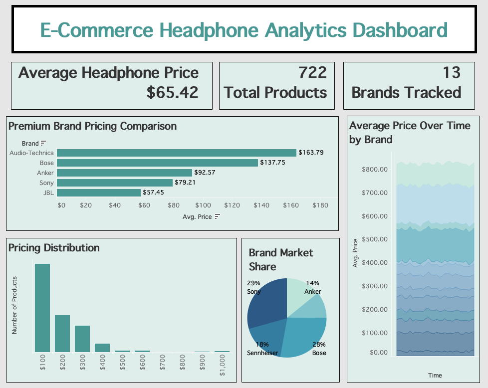

[Tableau Link](https://public.tableau.com/app/profile/rehma.uzair/viz/E-CommerceHeadphoneAnalyticsDashboard/E-CommerceHeadphoneAnalyticsDashboard?publish=yes)

# Headphone Market & Pricing Analytics Dashboard
Automated e-commerce analytics project that scrapes headphone pricing data from online retail listings, simulates historical pricing trends, and visualizes market insights through an interactive Tableau dashboard.

## Features
- Scrape headphone product listings and pricing data using Python and BeautifulSoup.
- Clean and transform large retail datasets using Pandas and regular expressions.
- Generate simulated historical pricing data for time-series trend analysis.
- Analyze brand pricing trends, market share, and product price distributions.
- Create KPI metrics and interactive Tableau dashboards for retail market monitoring.
- Visualize pricing trends, brand comparisons, histograms, pie charts, and segmentation insights.

## Technologies
Backend/Data Processing: Python, Pandas, BeautifulSoup, Regex
Data Visualization: Tableau

## Dashboard

[Tableau Link](https://public.tableau.com/app/profile/rehma.uzair/viz/E-CommerceHeadphoneAnalyticsDashboard/E-CommerceHeadphoneAnalyticsDashboard?publish=yes)
## Dashboard Preview

